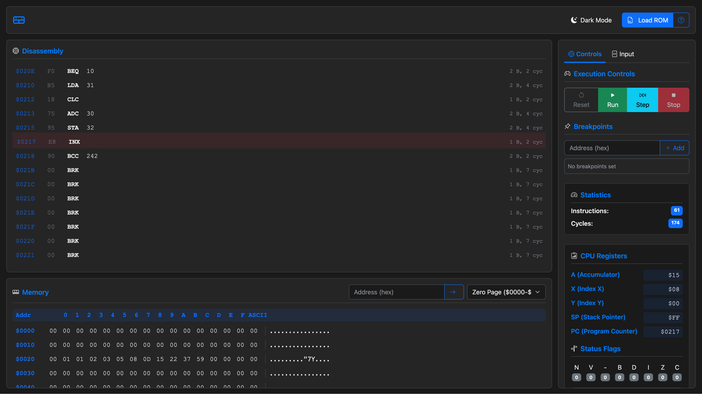

# 6502 Online Debugger

An interactive 6502 microprocessor emulator and debugger for the Nintendo Entertainment System (NES), providing educational insights into retro computing. Available at [codeknight.dev](https://codeknight.dev/).



## Features

- **Full 6502 CPU Emulation**: Accurately emulates all official 6502 opcodes and addressing modes
- **Interactive Debugging**: Step-by-step execution with register and memory inspection
- **Memory Visualization**: Real-time view of memory contents and changes
- **Cross-platform**: Runs in any modern browser thanks to WebAssembly

## Getting Started

The debugger is accessible online at [codeknight.dev](https://codeknight.dev/), but you can also run it locally or contribute to its development.

### Prerequisites

- Docker and Docker Compose (for containerized development)
- Modern web browser with WebAssembly support

## Local Setup

### Quick Start
```bash
# Clone the repository
git clone https://github.com/MaxwellKnight/nes-emulator.git
cd nes-emulator

# Start development environment with web server
docker compose --profile dev up web-dev

# Build everything (native + WebAssembly)
docker compose run --rm dev

# Run tests
docker compose run --rm test

# Get an interactive shell
docker compose run --rm shell
```

### Production Preview
```bash
# Start production environment locally
docker compose --profile prod up -d web-prod

# Stop production services
docker compose --profile prod down
```

Access the application at http://localhost:5173 during development or through the configured domain in production.

### Local Development (without Docker)

For those who prefer developing without containers:

- **Requirements**: 
  - C++17 compatible compiler
  - CMake 3.14 or newer
  - Google Test framework
  - Emscripten SDK (for WebAssembly compilation)

- **Building**:
  ```bash
  mkdir build && cd build
  cmake ..
  make
  ```

## Usage Guide

### Basic Operation

1. Navigate to [codeknight.dev](https://codeknight.dev/)
2. Use the "Load ROM" to upload a binary or paste 6502 compiled binary code 
    and click "Load Opcods"(online assembler [masswerk.at](https://www.masswerk.at/6502/assembler.html))
3. Use the debugger controls to:
   - Step through code one instruction at a time
   - Run code until a breakpoint
   - Reset the emulator state

### Memory and Register Inspection

- The register panel shows current values of A, X, Y, SP, and status flags
- Memory can be viewed and edited in the memory panel
- Watch specific memory addresses by adding them to the watch list

## Architecture

The emulator is built with a focus on accuracy and educational value:

- Core 6502 CPU emulation written in C++
- WebAssembly compilation for browser execution
- Modern front-end interface built with HTML/CSS/JavaScript

## License

This project is licensed under the GNU GPL v3 - see the [LICENSE](LICENSE) file for details.
