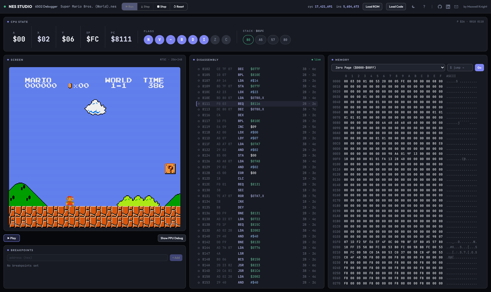

# NES Emulator + 6502 Studio

This is an NES emulator I wrote in C++, compiled to WebAssembly, with a browser
debugger on top called **NES Studio**. You can single-step a real 6502, poke at
memory while it runs, watch the PPU draw, and (the fun part) actually play games in
the same window. Super Mario Bros. boots straight into a playable 1-1.

The CPU is the part I'm most happy with. It passes `nestest` and blargg's
`instr_test` suites, and matches the `nestest` golden log cycle for cycle.



## What's in it

The 6502 core does all 151 official opcodes plus the documented "illegal" ones. Real
games use them, so you don't get far without them. The PPU handles backgrounds,
sprites, OAM and `$4014` DMA, 8x8 and 8x16 sprites, sprite-0 hit, scrolling, and all
four mirroring modes. There's an APU (two pulse channels, triangle, noise) wired to
WebAudio, and five mappers: NROM, MMC1, UxROM, CNROM, and MMC3 with its scanline IRQ.

On top of the core, NES Studio gives you the usual debugger stuff: step, run,
breakpoints, live disassembly, a memory editor, CPU and PPU state, pattern, nametable
and OAM viewers, and a full-screen Play mode.

It's covered by 32 native (gtest) and 211 web (Vitest) tests, and the conformance
suite below runs the real NES test ROMs in CI.

## Conformance

Unit tests are great for catching "I broke ADC" but useless for the subtle timing
bugs that actually break games. For those I lean on the test ROMs everyone in the
emulator world uses. The harness in
[`tests/conformance_test.cpp`](tests/conformance_test.cpp) runs them through the real
core and reads back each ROM's own pass/fail report. The ROMs aren't committed; a
script grabs them on demand.

Here's where things stand:

| Test ROM | Author | What it checks | Status |
|----------|--------|----------------|:------:|
| `nestest` | kevtris | Every official + illegal CPU opcode | pass |
| `instr_test` 01-basics | blargg | Basic instructions | pass |
| `instr_test` 02-implied | blargg | Implied + unofficial opcodes | pass |
| `instr_test` official_only (16 ROMs) | blargg | All official instructions | pass |
| `instr_timing` | blargg | Instruction cycle timing | pass |
| `ppu_vbl_nmi` | blargg | PPU VBlank/NMI dot timing | not yet |

That last one fails on purpose, and I left it in the scoreboard rather than hiding
it. The PPU renders a whole scanline at a time instead of dot by dot. That's plenty
accurate for real games and sprite-0 splits, but not for the cycle-exact PPU timing
ROMs. Going dot-based is the next big accuracy job; there's more on the why in
[`docs/ARCHITECTURE.md`](docs/ARCHITECTURE.md). If a ROM is missing the harness skips
it instead of failing, so a fresh clone stays green.

```bash
./tests/roms/fetch_test_roms.sh          # grab the ROMs (once)
cd native_build && ctest -R conformance  # run the scoreboard
```

## Playing games

| Game | Mapper | How far it gets |
|------|:------:|-----------------|
| Super Mario Bros. | NROM (0) | Fully playable 1-1: walk, jump, scroll, status-bar split |
| Super Mario Bros. 3 | MMC3 (4) | Boots, attract demo plays (scanline IRQ split) |

Hit **Load ROM**, pick a `.nes` file, then **Play** for full-screen. Controls: arrows
for the D-pad, **X** is A (jump), **Z** is B, **Enter** is Start, **Shift** is Select.

## Headless library and watching an agent play

The same core also builds as a small C-ABI shared library (`libnesenv`) so you can drive
an NES from outside the browser, for example to script or train an agent. One handle is
one independent machine, handles share no state, and stepping is deterministic, so the
same inputs always produce the same frames.

```c
NesEnv* e = nes_create();
nes_load(e, rom, rom_len);
nes_step(e, RIGHT | A);                    // advance one frame with buttons held
const uint8_t* rgb = nes_framebuffer(e);   // 256x240 RGBA
```

Because stepping is deterministic, a whole play session is captured by the ROM plus one
controller byte per frame. Record a scripted agent into a self-contained `.nesmovie`,
either with the C++ tool or the Python one (they produce byte-identical output):

```bash
cmake --build native_build --target record_demo
./native_build/record_demo "Super Mario Bros.nes" smb.nesmovie
# or:  cd python && PYTHONPATH=. python3 examples/record_scripted.py "Super Mario Bros.nes" smb.nesmovie
```

Load that file with **Watch Movie** in NES Studio and the browser replays it frame for
frame. The WASM core and the native core are the same code, so they stay in lockstep,
which is how you watch an agent play in the browser with no backend at all.

On top of the ABI there is a Python package with a Gymnasium-style Super Mario Bros
environment (observation, action set, reward) and an optional Gymnasium adapter for
stable-baselines3. See [`python/README.md`](python/README.md) for generating movies,
the env API, and training; the design notes are in
[`docs/rl-env-spec.md`](docs/rl-env-spec.md).

## Running it

Easiest path is Docker:

```bash
git clone https://github.com/MaxwellKnight/nes-emulator.git
cd nes-emulator

docker compose --profile dev up web-dev    # dev server on http://localhost:5173
docker compose run --rm dev build_wasm.sh  # build the WASM core into web/src/wasm/generated/
docker compose run --rm test               # native build + gtest suite
```

### Just the front-end

The web app is in `web/` (pnpm, Node 20+):

```bash
cd web
pnpm install
pnpm dev         # Vite dev server
pnpm test        # Vitest
pnpm typecheck   # tsc --noEmit
pnpm build       # production bundle in web/dist
```

Heads up: the compiled `cpu_wasm.js` and `cpu_wasm.wasm` land in
`web/src/wasm/generated/` and are gitignored, so build the WASM target first or the
front-end won't have a real core to talk to.

### Native build + tests, no Docker

You'll need a C++17 compiler, CMake 3.14+, and GoogleTest.

```bash
cmake -B native_build -DCMAKE_BUILD_TYPE=Debug
cmake --build native_build -j
./tests/roms/fetch_test_roms.sh      # optional, turns on the conformance suite
cd native_build && ctest --output-on-failure
```

## How it's built

The short version: a `Bus` wires together the `CPU`, `PPU`, `APU`, and the
cartridge/mapper, and steps them at the NES's 1 CPU to 3 PPU ratio. That core
compiles once and gets linked into both the native test binaries and a WASM module,
which a typed TypeScript bridge (`web/src/wasm/`) wraps for the React app. The UI is
Vite + React 18 + TypeScript + Tailwind, with the emulator state living in a context
provider.

The longer version, including the timing model, the trade-offs I made, and a war
story about a one-dot bug that froze Mario, is in
[`docs/ARCHITECTURE.md`](docs/ARCHITECTURE.md).

## License

GPL v3. See [LICENSE](LICENSE).
